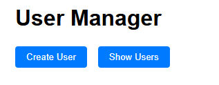
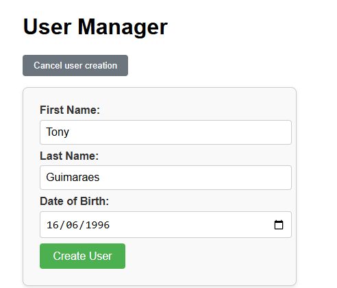
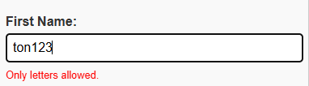
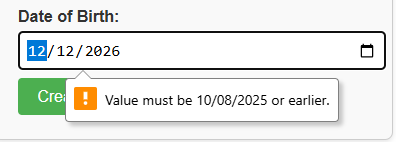
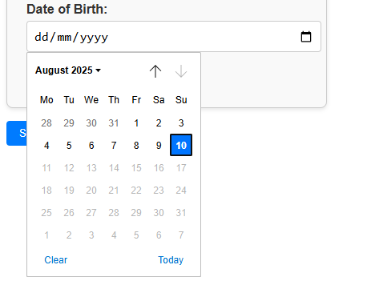
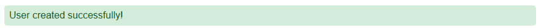
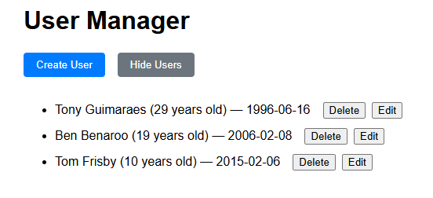
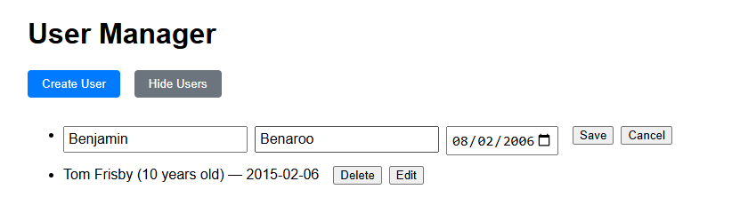
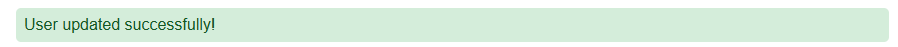
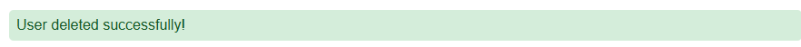

# FS Take Home Test

This repository hosts the code for a TCM test assignment. The requirements are outlined [here](assignment.md).

---

## User Manager App Overview

This app lets you create, view, edit, and delete users, each with a first name, last name, and date of birth (which is used to calculate and display age). The UI also provides some validation feedback to ensure data quality.

---

## Screenshots & Features

### Landing Page

Shows initial options to create a user or view the user list.

---

### Creating a New User

- The form only allows letters in name fields.
- Date of birth cannot be a future date.
- Validation errors are shown inline.

  
*User creation form with input fields.*

  
*Shows error when entering invalid characters in name fields.*

  
*Shows error if the date of birth is in the future.*

  
*Date picker restricted to today or earlier.*

---

### Successful User Creation

After submitting a valid form, a success message confirms creation.

  

---

### Viewing Users List

- Displays all users with their age and date of birth.
- Options to edit or delete each user.

---

### Editing a User

- Inline editing replaces the user display.
- Same validations as creation apply.
- Save or cancel changes.

---

### Successful User Update

After saving edits, a success message appears.

---

### Deleting a User

- Click "Delete" button to remove a user.
- Success message confirms deletion.

